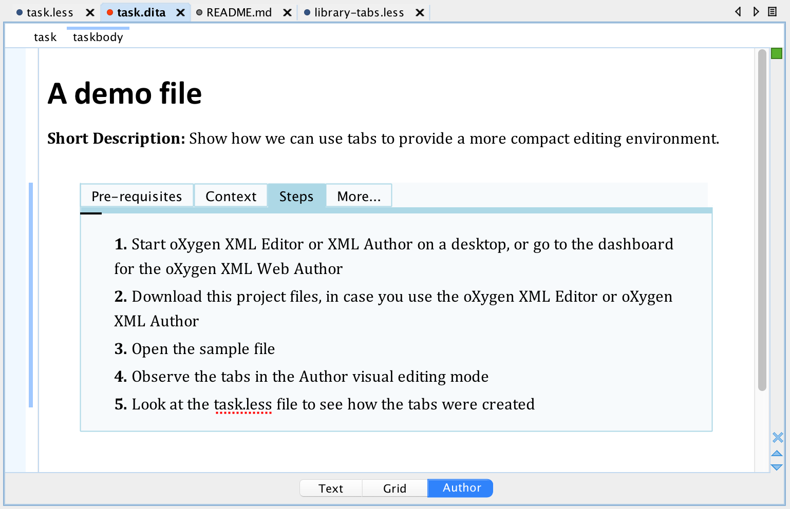

# Authoring eXperience with oXygen (AX)

Samples showing samples for controlling the Authoring eXperience with oXygen

## Using Tabs

The `tabs` folder contains a sample showing how one can use tabs.
We use a LESS library to implement support for tabs, and then in the main
LESS file we can declaratively mention that we want tabs for a specific element
like

```css
.tabs (
    selector1, selector2, ... selectorN;
    label1, label2, ...       labelN;    
)
```

or, if we want all the other elements not selected by the specified selectors to be
available in a last tab, we can use 

```css
.tabsWithOthers (
    selector1, selector2, ... selectorN;
    label1, label2, ...       labelN;
    labelForLastTab    
)
```

So, basically, in order to create 4 tabs for a DITA task for the content of 
a `taskbody` element, one containing the content of the `prereq` element 
labeled `Pre-requisites` another the content of `context` labeled `Context`,
the 3rd tab containing the content of `steps` labled `Steps` and a last tab 
containing all the other elements labeld `More....` we can use something like:


```css
taskbody{
    .tabsWithOthers(
        prereq, context, steps;
        Pre-requisites, Context, Steps;
        'More...'
    );
}
```

If we have a `div` element containing code samples in `codeblock` elements for 
different languages, marked with the `outputclass` attribute, then in order to
create 3 tabs to show Java, CPP and XML blocks, we can use something like:


```css
div{
    .tabs(
        "codeblock[outputclass~='language-java']", 
        "codeblock[outputclass~='language-cpp']", 
        "codeblock[outputclass~='language-xml']";
        Java, CPP, XML;
    );
}
```

Here it is the how the sample DITA task file (`tabs/samples/task.dita`) is rendered 
in the oXygen XML Author mode



or you can try it live in the oXygen XML Web Author with the tabs described above, specified in the 
`tabs/css/task.less` file:
[task.dita](https://www.oxygenxml.com/webapp-demo-aws/app/oxygen.html?url=github%3A%2F%2FgetFileContent%2Foxygenxml%2Fax%2Fmaster%2Ftabs%2Fsample%2Ftask.dita).

